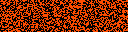

# Conway's Game of Life

A representation of [Conway's Game of Life](https://en.wikipedia.org/wiki/Conway%27s_Game_of_Life).

> The universe of the Game of Life is an infinite, two-dimensional orthogonal grid of square cells, each of which is in one of two possible states, live or dead (or populated and unpopulated, respectively). Every cell interacts with its eight neighbours, which are the cells that are horizontally, vertically, or diagonally adjacent.

## Preview

## Config Values

| Key          | Type     | Description                       | Default    |
| ------------ | -------- | --------------------------------- | ---------- |
| `cellSize`   | `number` | The width and height of each cell | 1          |
| `color`      | `string` | The color of each cell            | `"orange"` |
| `frameCount` | `number` | The amount of frames to animate   | 70         |
| `frameRate`  | `number` | In frames per second              | 10         |
